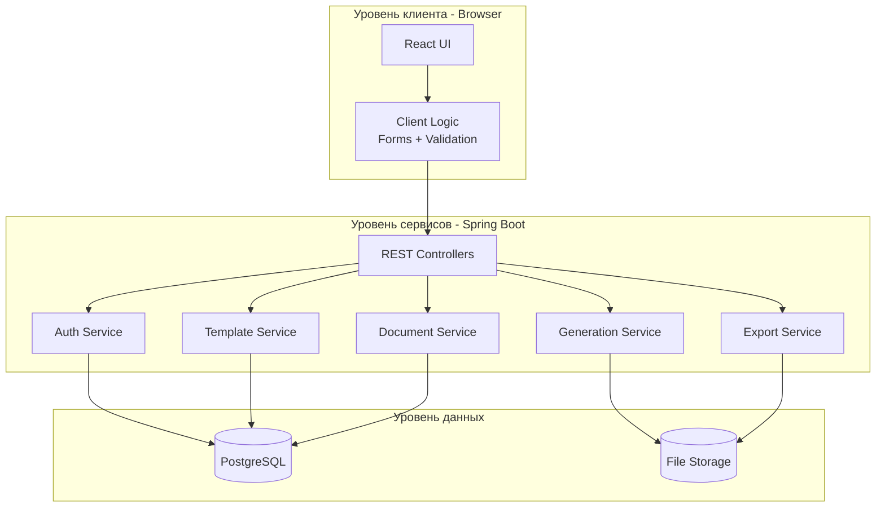
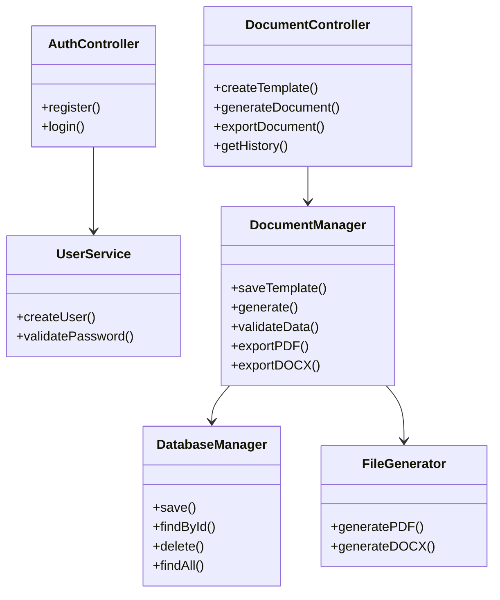

---

# Архитектурный отчет  
**Проект:** Web-приложение «Генератор документов»  

---

# Часть 1. Проектирование архитектуры ("To Be" — Как должно быть)

Описываем целевую (идеальную) архитектуру системы.

## 1. Тип приложения

**Web Application, Single Page Application (SPA).**  
Клиентская часть реализована на React и работает в браузере пользователя.  
Серверная часть — REST API на Spring Boot.  
Обмен данными происходит по HTTPS.

---

## 2. Стратегия развертывания

**Распределенная (Client–Server Architecture).**

Обоснование:  
Система разделена на:

- Клиентский уровень (React SPA)
- Серверный уровень (Spring Boot API)
- Уровень данных (PostgreSQL + файловое хранилище)

Компоненты физически размещаются на разных узлах:
- Браузер пользователя
- Сервер приложений
- Сервер базы данных

Это позволяет:
- Масштабировать backend независимо от frontend
- Обеспечить безопасность данных
- Поддерживать одновременную работу 1000+ пользователей

---

## 3. Обоснование выбора технологий

### Backend
- **Java + Spring Boot** — стабильный enterprise-фреймворк для создания REST API
- **Spring Security + JWT** — безопасная аутентификация и авторизация
- **PostgreSQL** — надежная реляционная БД
- **Apache POI / iText** — генерация DOCX и PDF документов

### Frontend
- **React + TypeScript** — модульная архитектура, масштабируемость
- **Material UI / Ant Design** — современный UX
- **React Hook Form / Formik** — удобная работа с формами

---

## 4. Показатели качества

### Usability
- Интуитивный интерфейс
- Процесс генерации документа ≤ 5 минут
- Адаптивный дизайн

### Security
- Хэширование паролей (BCrypt)
- JWT-аутентификация
- HTTPS
- Ограничение доступа к документам по владельцу

### Performance
- Загрузка интерфейса ≤ 3 секунд
- Генерация документа ≤ 10 секунд
- Поддержка ≥ 1000 одновременных пользователей

---

## 5. Сквозная функциональность (Cross-cutting functionality)

- Логирование (Spring Boot Logging)
- Глобальная обработка ошибок (Global Exception Handler)
- Валидация данных (Bean Validation)
- Аутентификация через JWT Filter
- Role-based access control (RBAC)
- Транзакционность операций (Spring @Transactional)

---

## 6. Структурная схема (To Be)

---

# Часть 2. Анализ архитектуры ("As Is" — Как реализовано сейчас)

В текущей реализации система представляет собой логически разделенный, но фактически монолитный backend.

Несмотря на наличие отдельных классов, отсутствует четкое разделение слоев (Controller → Service → Repository реализованы частично).

## Диаграмма классов/модулей (As Is)

---

# Часть 3. Сравнение и рефакторинг

## 1. Сравнение "As Is" и "To Be"

| To Be | As Is |
|-------|--------|
| Четкое разделение слоев | Частичный монолит |
| Отдельные сервисы | Перегруженный DocumentManager |
| Чистая архитектура | Смешение логики |
| Расширяемость | Ограниченная масштабируемость |
| Явная безопасность | Базовая реализация |

---

## 2. Отличия и их причины

Основное отличие — отсутствие полной реализации многослойной архитектуры.

Причины:
- Учебный формат проекта
- Ограниченное количество функций на раннем этапе
- Отсутствие необходимости горизонтального масштабирования

В текущем состоянии присутствует «God Object» — `DocumentManager`, который выполняет слишком много обязанностей.

---

## 3. Пути улучшения (Рефакторинг)

Чтобы привести систему к архитектуре "To Be", необходимо:

### 1. Внедрить строгую многослойную архитектуру:

- Controller — только REST
- Service — бизнес-логика
- Repository — доступ к данным

### 2. Разделить DocumentManager на:

- TemplateService
- DocumentService
- GenerationService
- ExportService

### 3. Внедрить:

- DTO + Mapper (MapStruct)
- Spring Security с полноценным RBAC
- Кэширование (Redis) для производительности
- Docker-контейнеризацию
- Nginx как reverse proxy

### 4. Следовать принципам SOLID:

- Single Responsibility
- Dependency Injection
- Open/Closed Principle

---

# Итог

Архитектура "To Be" соответствует:

- Функциональным требованиям (генерация, экспорт, история, шаблоны)
- Нефункциональным требованиям (безопасность, производительность, масштабируемость)
- Современным стандартам enterprise-разработки

Архитектура "As Is" является упрощенной реализацией и требует рефакторинга для достижения промышленного уровня качества.

---